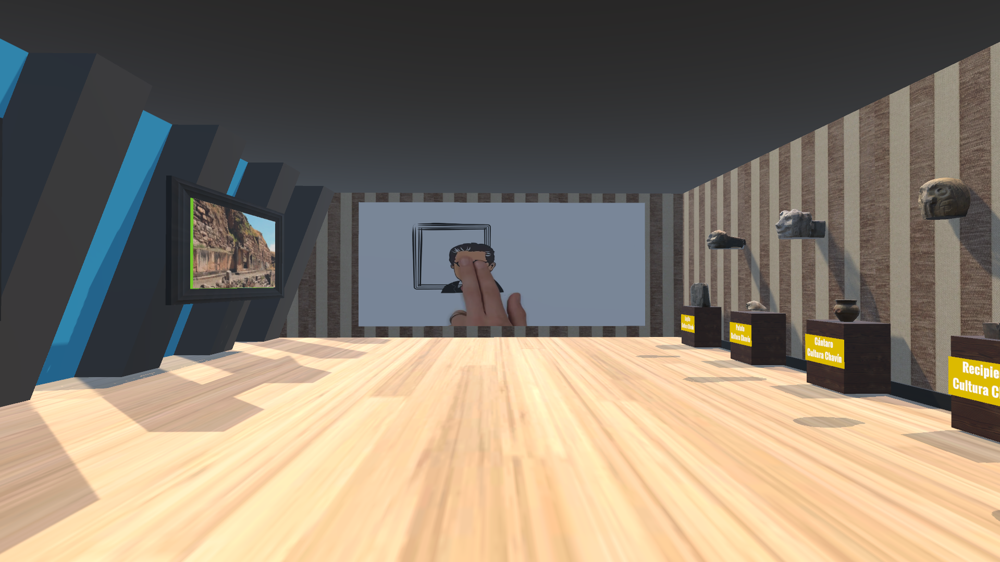
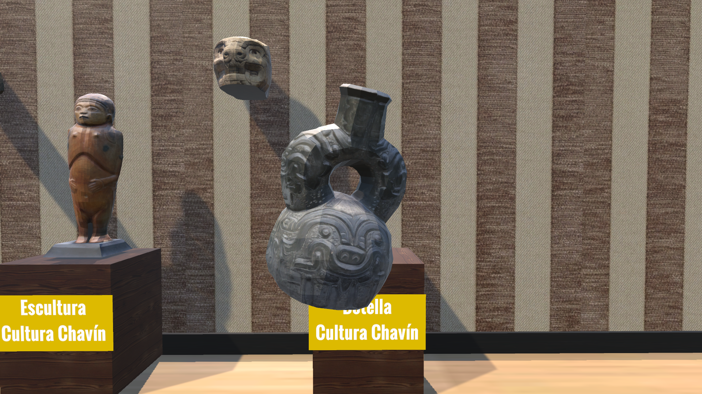
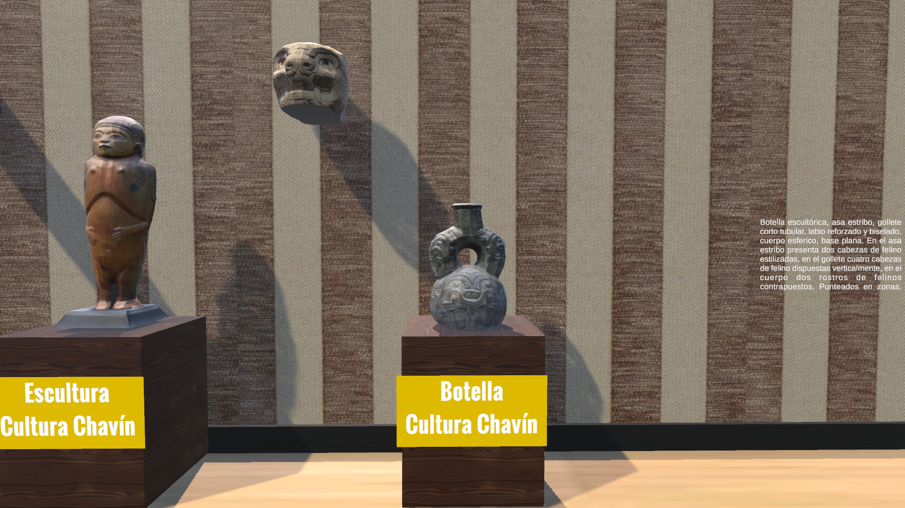
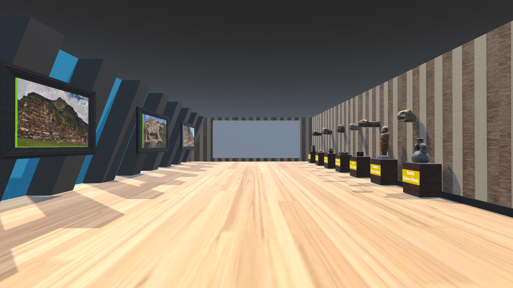

# 🏛️ Desarrollo de un Museo Virtual Interactivo en 3D para la Difusión y Aprendizaje del Patrimonio Histórico Peruano.

Bienvenido al repositorio de este proyecto de investigación aplicada[cite: 1]. Esta propuesta tecnológica consiste en un prototipo funcional diseñado para democratizar el acceso al patrimonio cultural mediante la virtualización.

## 💻 Descargar y Jugar (PC)
[Descargar el Juego para Windows (RAR) aquí](https://github.com/Rodri-27/Museo-Virtual/releases/download/v1.0/Museo.rar)

*(Instrucciones: Descarga el archivo RAR, haz clic derecho sobre él, selecciona "Extraer aquí" o "Extraer en Museo\" y luego entra a la carpeta extraída para ejecutar el archivo .exe e iniciar el recorrido).*

## 🎥 Demostración en Video
Haz clic en la imagen a continuación para ver el recorrido completo del museo virtual:

## 💡 El Motivo del Proyecto
Esta iniciativa busca ofrecer una solución innovadora ante la pasividad de los métodos tradicionales de aprendizaje de la historia. El objetivo central es construir un entorno interactivo que rompa la pasividad contemplativa, transformando al espectador en un agente activo que explora de manera autónoma para generar un vínculo emocional y mejorar la retención de la información.

## ⚙️ Desarrollo Técnico
El entorno fue desarrollado íntegramente utilizando el motor gráfico Unity. 
* **Arquitectura del Entorno:** Se modeló un espacio tridimensional que simula un espacio museístico ambientado en un lugar turístico representativo del Perú, estructurado como un pasillo secuencial. 
* **Navegación:** Se implementó un sistema de movimiento básico que permite controlar a un personaje en primera persona utilizando teclado y mouse.
* **Interactividad:** La exhibición de los hitos históricos se realiza mediante paneles interactivos y recursos multimedia que responden a la proximidad del personaje o a la selección directa del usuario.

## 📸 Recorrido Visual

A continuación, un vistazo a la interfaz y el entorno tridimensional:

| | |
|:---:|:---:|
|  |  |
|  |  |
